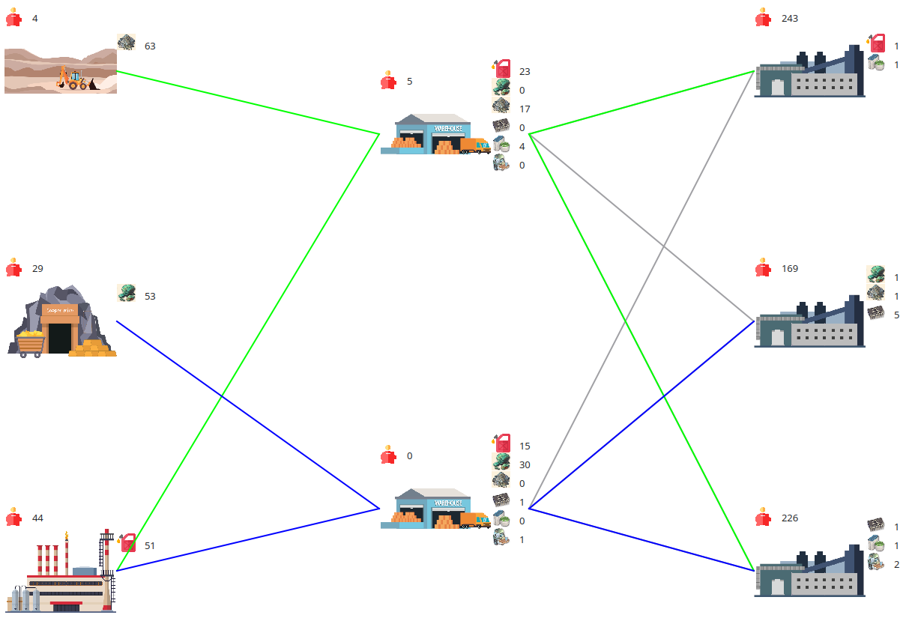
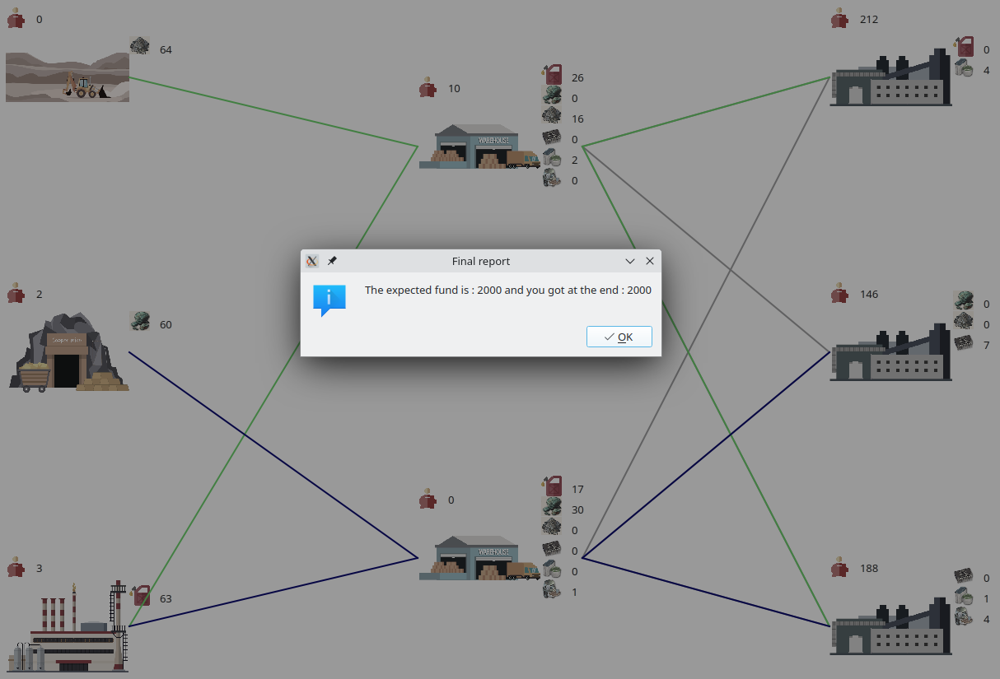
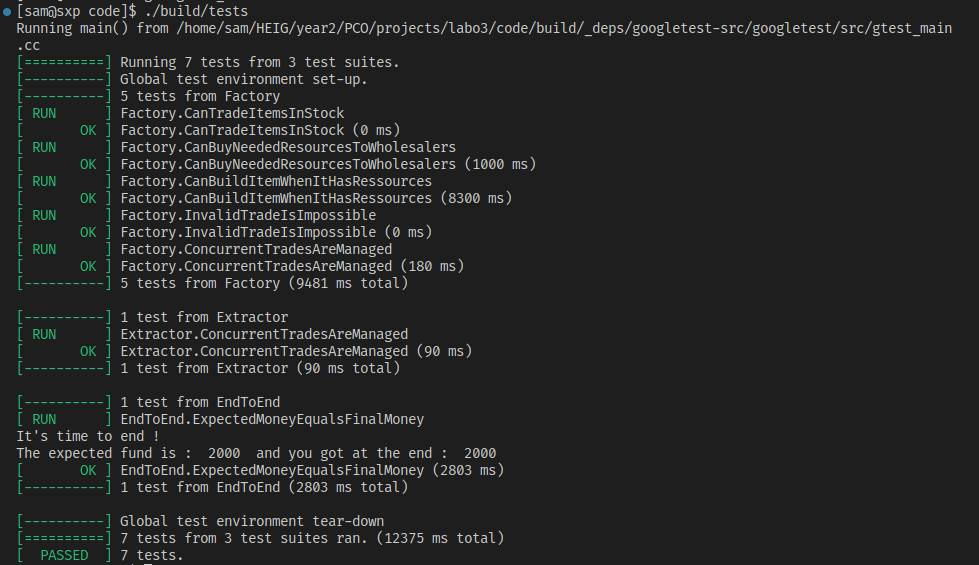

# Labo 3 report - Managing concurrent access - PCO

Authors: Vitória Oliveira et Samuel Roland

## Introduction
This project consists in a sales simulation application with extractors, wholesalers and factories. They are constantly selling and/or buying resources from/to other entities. The program has a UI that shows in real time the resources and funds of each entity.

The primary goal of this project is to effectively address problems associated with concurrent accesses such as the protection of resources that can be manipulated by multiple threads at the same time. This report documents our strategies in implementing solutions to tackle these issues. 

## Description of software features

## Implementation Choices
The first important point to understand is that stocks and funds can only be modified by its owner as they are private attributes. The concurrent access on these variables is caused by the multiple entities in different threads that request a trade in parallel. The transaction (reading and changing the fund and the stocks) must be done atomically, therefore we used a mutex per entity.

In general, we excluded calls to `PcoThread::usleep` from critical sections to prevent blocking other threads while one is "paused". We've tried to minimize calls to other functions (except for getters) whenever possible to avoid delaying program execution. However, calls to the trade function were an exception in Factory::orderResources and Wholesale::buyResources, as it was necessary to verify if the trade was possible.

### Mutex

We have implemented a protected access mutex within the Seller's class, which provides each subclass with its exclusive mutex.

As multiple threads might try to access the critical resources at the same time, we could have implemented one mutex for each resource to be secured as a way to ensure data integrity. However, in consideration of our project's specific requirements, we noticed that both money and stocks were consistently read and written within the same block of instructions. 

To simplify our implementation and enhance performance, we have opted for a single mutex to protect both variables. This mutex is acquired when we read or write to the money or stocks and is released once the operations are completed.

### Extractors
**Competition Management in `Extractor::run`**
It's necessary to acquire the instance's mutex in two steps to ensure that the current thread is the only one modifying the amount of money during the miner's payment and, later on, the modification of the stock. The sleep must not be included because it would block other threads to start a trade. Changing the `money` separately than the `stocks` is not risky in this particular case.

**`Extractor::trade`**  
First, it's essential to:  
- certify that the requested quantity is greater than 0 is made;
- verify that the requested item matches the item mined by the extractor 
- verify that the extractor has the requested quantity.

Once this is done, we can proceed with the transaction. Therefore, we need to update the seller's stock and funds.
Since multiple threads can attempt to perform transactions simultaneously, we need to manage concurrency. Since a stock check is performed before starting the transaction, it is vital to lock a mutex before this check is made to ensure that the updated stock corresponds to the stock previously returned and that no other threads have been able to change it between these two instructions.

### Wholesales
**`Wholesale::buyResources`**  
To start with, it is fundamental to acquire a mutex prior to: 
- verifying the availability of the wholesale's financial resources 
- confirming the feasibility of the trade through a call to the seller's trade function. 

This is necessary to prevent a potential interference by another thread that may alter the wholesale's finances or the seller's inventory. Once this is done, we can proceed and update the wholesale's funds and inventory,  after which the mutex can be released. 

**`Wholesale::trade()`**  
Similar to Extractor::trade, except for the conditions to proceed with the trade. It is necessary to check:
- if the requested quantity is strictly positive
- if this quantity for the wanted item is available in stock

Another difference is that we use `getCostPerUnit` function here instead of `getMaterialCost` (as it is not available in the Wholesale class but also more appropriate in this case). 

### Factories
**`Factory::buildItem`**
This function is called in `Factory::run` , right after checking if all resources needed are available in stock (through the `Factory::verifyResources`). 

Here, it is important to: 
- call `Factory::verifyResources` (even though this check is made before, it is necessary to verify once again inside this function as a call to trade might have modified the factory stocks in the meantime)
- check if we have enough money to pay a employee to build the item. 

If both checks pass, then the money paid to the worker is deducted, the stocks corresponding to the material used to produce the item are decreased, and the stocks are incremented by the quantity of items built (in our case always 1). 

**`Factory::orderResources`**
We iterate through the needed resources then we check if:
- the stocks for the neededResources == 0
- we have enough money to order the resources

We've chosen to create a shuffled copy of Wholesalers vector to prevent from always buying from the first sellers in the vector. 
If the conditions allow for an order, we can proceed to iterate through the shuffled Wholesalers vector to see who can sell us the item and call `Wholesaler::trade` on them. 
Once we've found the seller, we continue to decrement the price of the transaction from our fonds and increment our stocks. 

As for the concurrency management, we lock a mutex before verifying the stocks and money and unlock it when out of the if block. We do so because a call to `Factory::trade` may modify the stocks and money as we are in this block. 

***`Factory::trade`**
Here it is important to check if:
- the requested item is built by the current factory
- the requested quantity is strictly positive
- this quantity for the wanted item is available in stock

We need to do additional check to not sell resources used to produce the built item. For example a factory cannot sell Petrol. 
/* TODO on le fait pas encore, alors à implementer */

### Termination 
In order to ensure a proper termination of the simulation, we've declared a boolean variable called `stopRequest` in the file `Utils.cpp` that serves as signal to indicate if a request to end the simulation has been made. 
This variable is initially set to false and is set to true if a call to *Utils::endService()* is made (when the window is closed).

To take this in account elsewhere in the project, we've added a while loop that checks if `stopRequest` is true in all run functions for each Seller subclass.    

## Tests

**Manual tests**  
We conducted manual tests to evaluate the program's performance under normal conditions:

After around 50 seconds of execution, here is the visual state. The 2 wholesalers have almost no funds left.

Closing the window show the final report with the expected final amount of money.


Additionally, we made multiple manual tests with varying numbers of instances for each entity and different initial funds. We executed the program and verified that the results met our expectations.

**Automated tests**  
Do to more advanced testing on logic and concurrency protections, we tried to write some GoogleTest tests, mostly in the form of integration tests. To avoid needing to setup a Qt UI interface, we disabled the usage of the `interface` attribute, so we don't call `setInterface`. (Therefore the attribute `interface` is `NULLPTR` in tests). We created a macro `NTEST` used like this: `NTEST(interface...)` that doesn't run the given instruction in case the `GTEST` macro has been defined. This is kind of a "headless" mode. The interface is just a visualizer, we don't need them to test the logic and behaviors.

As we could figure out how to integrate GoogleTest and PcoSynchro and Qt with the existing `.pro` file and to benefit from VSCode CMake integration, we adapted a `CMakeLists.txt` made by Aubry and created a file `tests/tests.cpp`. To build it and run it from command line you can run:
```bash
cmake . -Bbuild && cmake --build build/ && ./build/tests
```

We added a method `std::map<ItemType, int> getStocks()` on the `Seller` class so we can make assertions on the final stocks in addition to the money with `getFund()`. We created a setter too `void setStocks(std::map<ItemType, int> stocks)` but we put its visibility in `protected` and each test that need its access is a friend of the method.

Each test has different needs. In some case we don't need to run object in threads, we for example just want to test that `trade()` only accept the trade when the entity has a stock and can sell the asked resource. In case the tested entity needed a wholesaler to order resources, we used a fake wholesaler (class `FakeWholesaler`) that can sell resources to the tested class and store what and how much has been sold.

We created one end-to-end test by instancing a `Utils` object and calling its `run` method to start, waiting a few seconds and calling `externalEndService` method to end.

To validate the concurrency protections on `Factory::trade()` and `Extractor::trade()` we have setup 2 tests:
```cpp
TEST(Factory, ConcurrentTradesAreManaged) {
    PlasticFactory pf(1, FACTORIES_FUND);
    const int ORIGINAL_STOCK = 20000;
    pf.setStocks({{ItemType::Plastic, ORIGINAL_STOCK}});

    runMassiveTrades(pf, ItemType::Plastic, ORIGINAL_STOCK, PLASTIC_COST);

    EXPECT_EQ(pf.getStocks().at(ItemType::Plastic), 0);
    EXPECT_EQ(pf.getFund(), FACTORIES_FUND + ORIGINAL_STOCK * PLASTIC_COST);
}
```
Most of the logic is inside `runMassiveTrades()` where we launch 8 threads to run `FakeWholesaler::massiveTrade()` that is just doing trades in loop until a trade fails. At the end of this method, we calculated and made expectations on the amount of money spent and total number of items bought in all threads. As the 2 last lines show, we checked on the factory that the final stock is effectively 0 and that the fund is coherent with all received money.

```cpp
EXPECT_EQ(originalQuantity * cost, totalMoneySpent);
EXPECT_EQ(originalQuantity, totalItemNumbersBought);
```

We tried to remove temporarily the use of mutex in `trade` and we see on the picture that our test is correctly detecting the wrong final state (more money has been spent than possible and more items have been bought that what is possible).


Finally, after some relatively important effort, the tests are working effectively and all are passing ! The test `Factory.CanBuildItemWhenItHasRessources` is a bit slow to run, probably because of the sleeps in `buildItem()`.


As it was a first experiment with GoogleTest we didn't have time to test all logic. Our test suite is focused on Factory, and concurrency on `Factory::trade` and `Extractor::trade`. We could have replicated some logic tests on `Extractor` and concurrency tests on `Wholesaler` and other methods (like `buildItem()` running at the same time of a `trade()`).

## Conclusion

Our primary objective was to efficiently handle concurrency in our dynamic sales simulation application. To achieve this, we created a reliable system to protect crucial resources in a multi-threaded environment by strategically placing multiple mutexes around critical code sections.

This system ensures that each entity has exclusive access to its essential resources, preventing conflicts and ensuring data consistency. Our approach also emphasizes efficiency by minimizing delays in program execution, especially when handling trade functions.


- TODO dans factory::orderResources(). 1 de quantité as variable quantity for code evolution (or add CONST STATIC for recette d'ingredients) + vérifier stock[it] < qtyNeeded

- TODO voir où on check la quantité d'un stock car on peut l'obtenir à partir de getItemsForSale.first == item voulu et on check .second qui nous dira la quantité disponible.
