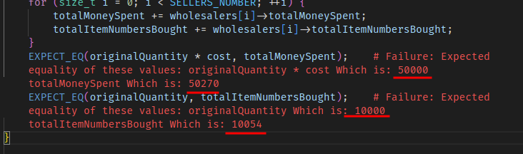

# Labo 3 report - Managing concurrent access - PCO

Authors: Vitória Oliveira et Samuel Roland

## Introduction
This project consists in a sales simulation application with extractors, wholesalers and factories. They are constantly selling and/or buying resources from/to other entities. The program has a UI that shows in real time the resources and funds of each entity.

The primary goal of this project is to effectively address problems associated with concurrent accesses such as the protection of resources that can be manipulated by multiple threads at the same time. This report documents our strategies in implementing solutions to tackle these issues. 

## Description of software features

## Implementation Choices
The first important point to understand is that stocks and funds can only be modified by its owner as they are private attributes. The concurrent access on these variables is caused by the multiple entities in different threads that request a trade in parallel. The transaction (reading and changing the fund and the stocks) must be done atomically, therefore we used a mutex per entity.

### Mutex
TODO: je pense que cette section peut être résumé en 2-3 phrases, je n'y vois pas un grand intérêt de rexpliquer pourquoi on aurait besoin de mutex.

- (TODO à effacer) QUESTION: MULTIPLE THREADS? 

The main problem of this project is to safeguard resources of a instance that might be accessed by multiple threads/functions simultaneously. More precisely, we've focused on protecting the stocks and funds of each Seller object as these variables are modify everytime Sellers build, buy and sell items to each other. 

- (TODO à effacer)  POURQUOI MUTEX EST PROTECTED ET DECLARE DANS SELLER

In order to do so, we've implemented a protected access mutex in Seller's class. This allows each subclass to have it's own exclusive mutex, ensuring that no other object can access it. This prevents data race conditions, where multiple functions within an object might attempt to access these resources concurrently.

- (TODO à effacer) INTERET DE CHAQUE OBJET D'AVOIR UN SEUL MUTEX PAR RESOURCE A PROTEGER 

As multiple functions in each object might try to access these resources at the same time, we've chosen to implement a single mutex for each resource to be secured as a way to ensure data integrity. This mutex was acquired  whenever we read or write to the money or stocks and is released once the operation is completed.

- (TODO à effacer) POURQUOI UN MUTEX POUR MONEY/STOCK ET PAS UN POUR CHAQUE RESOURCE

However, for our specific project requirements, we observed that money and stocks were consistently read and written to within the same block of instructions. To simplify our implementation and enhance performance, we opted for a single mutex to protect both variables.


### Extractors
**Competition Management in `Extractor::run`**
It's necessary to acquire the instance's mutex in two steps to ensure that the current thread is the only one modifying the amount of money during the miner's payment and, later on, the modification of the stock. The sleep must not be included because it would block other threads to start a trade. Changing the `money` separately than the `stocks` is not risky in this particular case.

**`Extractor::trade`**  
First, it's essential to check the arguments to proceed with the transaction. A check to certify that the requested quantity is greater than 0 is made; otherwise, it would not be logical neither necessary to carry out the transaction. It is also essential to verify that the requested item matches the item sold by the extractor and that the extractor has the requested quantity.

Once this is done, we can proceed with the transaction. Therefore, we need to update the seller's stock and funds.
Since multiple threads can attempt to perform transactions simultaneously, we need to manage concurrency. Since a stock check is performed before starting the transaction, it is vital to lock a mutex before this check is made to ensure that the updated stock corresponds to the stock previously returned and that no other threads have been able to change it between these two instructions.

### Wholesales
**`Wholesale::buyResources`**  
To start with, it is fundamental to acquire a mutex prior to verifying the availability of the wholesale's financial resources and confirming the feasibility of the trade through a call to the seller's trade function. This is necessary to prevent a potential interference by another thread that may alter the wholesale's finances or the seller's inventory. Once this is done, we can proceed and update the wholesale's funds and inventory,  after which the mutex can be released. 

**`Wholesale::trade()`**  
Similar to Extractor::trade, except for the conditions to proceed with the trade. It is necessary to check:
- if the requested quantity is strictly positive
- if this quantity for the wanted item is available in stock

TODO: ya probablement pas grand chose à dire, juste 1-2 phrases peut-être si ya des différences par rapport aux autres.
### Factories
**`Factory::buildItem`**
- /* TODO */

**`Factory::orderResources`**
- /* TODO */

***`Factory::trade`**
We need to do additional check to not sell resources used to produce the built item. For example a factory cannot sell Petrol.

### Termination 
In order to ensure a proper termination of the simulation, we've declared a boolean variable called `stopRequest` in the file `Utils.cpp` that serves as signal to indicate if a request to end the simulation has been made. 
This variable is initially set to false and is set to true if a call to *Utils::endService()* is made (when the window is closed).

To take this in account elsewhere in the project, we've added a while loop that checks if `stopRequest` is true in all run functions for each Seller subclass.    

## Tests

**Manual tests**  
After around 50 seconds of execution, here is the visual state. The 2 wholesalers have almost no funds left.

Closing the window show the final report with the expected final amount of money.


**Automated tests**  
Do to more advanced testing on logic and concurrency protections, we tried to write some GoogleTest tests, mostly in the form of integration tests. To avoid needing to setup a Qt UI interface, we disabled the usage of the `interface` attribute, so we don't call `setInterface`. (Therefore the attribute `interface` is `NULLPTR` in tests). We created a macro `NTEST` used like this: `NTEST(interface...)` that doesn't run the given instruction in case the `GTEST` macro has been defined. This is kind of a "headless" mode. The interface is just a visualizer, we don't need them to test the logic and behaviors.

As we could figure out how to integrate GoogleTest and PcoSynchro and Qt with the existing `.pro` file and to benefit from VSCode CMake integration, we adapted a `CMakeLists.txt` made by Aubry and created a file `tests/tests.cpp`. To build it and run it from command line you can run:
```bash
cmake . -Bbuild && cmake --build build/ && ./build/tests
```

We added a method `std::map<ItemType, int> getStocks()` on the `Seller` class so we can make assertions on the final stocks in addition to the money with `getFund()`. We created a setter too `void setStocks(std::map<ItemType, int> stocks)` but we put its visibility in `protected` and each test that need its access is a friend of the method.

Each test has different needs. In some case we don't need to run object in threads, we for example just want to test that `trade()` only accept the trade when the entity has a stock and can sell the asked resource. In case the tested entity needed a wholesaler to order resources, we used a fake wholesaler (class `FakeWholesaler`) that can sell resources to the tested class and store what and how much has been sold.

We created one end-to-end test by instancing a `Utils` object and calling its `run` method to start, waiting a few seconds and calling `externalEndService` method to end.

To validate the concurrency protections on `Factory::trade()` and `Extractor::trade()` we have setup 2 tests:
```cpp
TEST(Factory, ConcurrentTradesAreManaged) {
    PlasticFactory pf(1, FACTORIES_FUND);
    const int ORIGINAL_STOCK = 20000;
    pf.setStocks({{ItemType::Plastic, ORIGINAL_STOCK}});

    runMassiveTrades(pf, ItemType::Plastic, ORIGINAL_STOCK, PLASTIC_COST);

    EXPECT_EQ(pf.getStocks().at(ItemType::Plastic), 0);
    EXPECT_EQ(pf.getFund(), FACTORIES_FUND + ORIGINAL_STOCK * PLASTIC_COST);
}
```
Most of the logic is inside `runMassiveTrades()` where we launch 8 threads to run `FakeWholesaler::massiveTrade()` that is just doing trades in loop until a trade fails. At the end of this method, we calculated and made expectations on the amount of money spent and total number of items bought in all threads. As the 2 last lines show, we checked on the factory that the final stock is effectively 0 and that the fund is coherent with all received money.

```cpp
EXPECT_EQ(originalQuantity * cost, totalMoneySpent);
EXPECT_EQ(originalQuantity, totalItemNumbersBought);
```

We tried to remove temporarily the use of mutex in `trade` and we see on the picture that our test is correctly detecting the wrong final state (more money has been spent than possible and more items have been bought that what is possible).


Finally, after some relatively important effort, the tests are working effectively and all are passing ! The test `Factory.CanBuildItemWhenItHasRessources` is a bit slow to run, probably because of the sleeps in `buildItem()`.


As it was a first experiment with GoogleTest we didn't have time to test all logic. Our test suite is focused on Factory, and concurrency on `Factory::trade` and `Extractor::trade`. We could have replicated some logic tests on `Extractor` and concurrency tests on `Wholesaler` and other methods (like `buildItem()` running at the same time of a `trade()`).

## Conclusion
/* TODO */

- TODO expliquer pourquoi on a deux mutex dans extractor::run (à cause du sleep) et TODO pourquoi on en un slmt 1 dans factory

- TODO pourquoi verifyRessources dans buildItem alors que deja dans run (risque de preemption entre les deux?)

- TODO expliquer pourquoi on ne fait rien concernant le commentaire "acheter en priorite celui que l'usine n'a pas en stock" car de toute facon on ne va acheter que si stock[item] == 0. donc il n'y a rien à vérifier. 

- TODO add message d'affichage

- TODO dans factory::orderResources(). 1 de quantité as variable quantity for code evolution (or add CONST STATIC for recette d'ingredients) + vérifier stock[it] < qtyNeeded

- TODO voir où on check la quantité d'un stock car on peut l'obtenir à partir de getItemsForSale.first == item voulu et on check .second qui nous dira la quantité disponible.

- Factory::orderResources
on itere sur les resources necessaires:
    on regarde si on a besoin du produit et si on a assez d'argent, sinon ca sert à rien d'itérer sur les wholesalers alors qu'on a pas besoin/peut pas acheter le produit
        on itère sur les sellers 
            on regarde qui peut nous fournir le produit
                on l'achete
mutex dès qu'on vérifie les fonds car on veut pas que les fonds diminue avant d'acheter le produit (par exemple dans buildItem) (pas besoin de mettre mutex pour le stock car ici on vérifie si stock[0] et si stock[0] il ne peut pas diminuer ailleurs et s'il augmente c'est pas grave MAIS pas forcément besoin de l'acheter MAIS par question d'évolutivité ce ne serait pas grave de le sécuriser)

- TODO expliquer stratégie générale des mutex. Un mutex par chaque instance d'objet car chaque objet possède ses propres fonds & stock & est le seul à y avoir accès. Aussi car lorsqu'une transaction est faite, elle est implementé dans le vendeur. Ainsi, le vendeur a accès à ses resources. Et le stock & fonds de l'acheter est mis à jour lorsqu'il appelle la fonction trade de l'objet à qui il veut acheter (notamment dans la fonction run).

- TODO appeler requestStop de pcothread 
